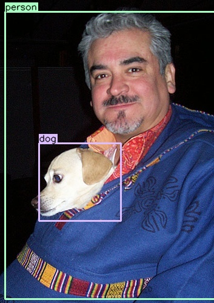
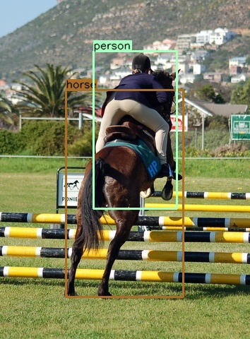
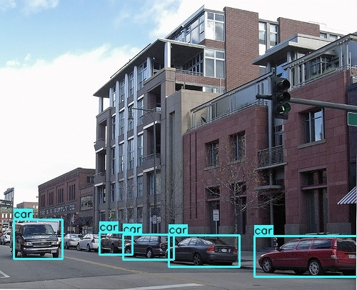
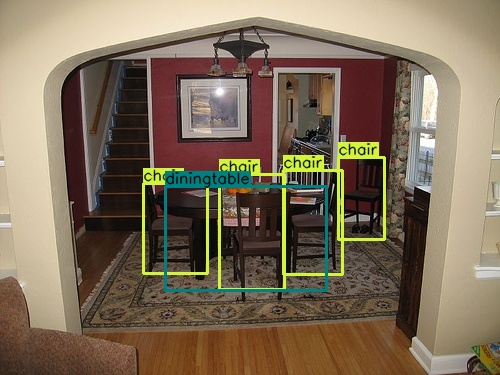
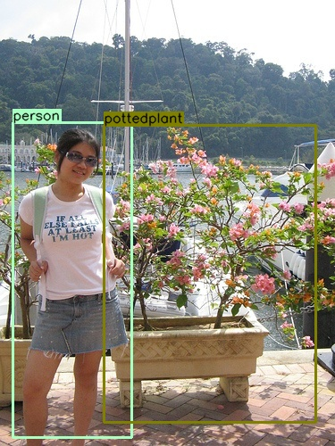

# [Single shot detection implementation](https://arxiv.org/abs/1512.02325)

## Objectives
This work is for learning purpose and the main goal is to recreate the results of SSD300 on Pascal VOC 2007 + 2012 dataset 
as published in this [paper](https://arxiv.org/abs/1512.02325).

## Illustrations
#### Results on VOC2007 test set (mAP)
| Backbone          | Input Size |   mAP   | Model Size | Download  |
| :---------------: | :---------:| :-----: | :--------: | :-------: |
|  VGG16 by lufficc |     300    |  77.7   |   101 MB   | [model](https://github.com/lufficc/SSD/releases/download/1.2/vgg_ssd300_voc0712.pth)  |
|  VGG16 by me      |     300    |  60.9   |   101 MB   | none      |
|  VGG16 2nd attempt|     300    |  77.2   |   101 MB   |           |
|  Mobilenet V2     |     320    |  70.5   |   21.9 MB  | [model](https://github.com/ncthuan/single-shot-detection-pytorch/releases/download/0.0/ssd_efficientnet_b3.pt)  |
|  EfficientNet-B3  |     300    |  78.3   |   47.7 MB  | [model](https://github.com/ncthuan/single-shot-detection-pytorch/releases/download/0.0/ssd_mobilenetv2.pt)  |
 
#### Samples
 
 
 

 
 

## Dependencies
* Python 3
* PyTorch 1.6.0
* OpenCV 4.3.0
* albumentations 0.4.6

## Notes
* Many thanks to a very [detailed tutorial](https://github.com/sgrvinod/a-PyTorch-Tutorial-to-Object-Detection) by sgrvinod

* The training took place in Google Colab runtime so big appreciation to Google for the generous offer of free GPUs

* Data: 
Training set: VOC07+12 trainval set 
Test set: VOC07 test set,... actually, I'm using this test set as my validation set and the rest for training 
Annotation: all .xml annotation files was parsed in to one big json file.

* Data augmentation: I use mainly [albumentations](https://github.com/albumentations-team/albumentations) and OpenCV, 
and there were a few differences from the paper, the zoom out operation only shrinks the image by a factor of at most 2.5 times and also discards any object
that has the area of its bounding box smaller than 150px. 
I believe that objects with that low resolution are really difficult for the model to learn and to detect.

* My implementation of the original SSD300 performs quite poorly due to some reasons, i believe, like 
I didn't apply custom L2Norm to the conv4_3 layer as in the paper, 
my modeling code was kinda messy, not really well structured and probably messed up somewhere that I didn't even notice,
I also didn't use pretrained weights for faster and more reliable learning,
and probably ran into some gradient vanishing/exploding situtation, which really likely to happen with VGG.

* Tried mixed precision O1 level on Google Colab's Tesla T4 GPU but no significant improvement in training speed.

* In order to experience faster training, I thought I could try some light weight backbones so I employed MobilenetV2 and EfficientNet-B3 
but training time didn't improve much. Turns out there was a bottleneck in data loading.
There wasn't enough computing resource to feed data to the GPU, since Colab only provide CPU with 1 or 2 core.
So I had to turn to optimize my augmentation and dataloader code to tackle it.

* In the SSD model with EfficientNetB3 as the backbone, I used pretrained weight from 
[lufficc's SSD implementation](https://github.com/lufficc/SSD/tree/master/) and included some layers that replicate the idea of Feature Pyramid Networks.
which probably improved the net's performance on smaller objects. The performance improved from 73.9 mAP (lufficc's implementation) to 78.3 mAP.

## To do
* Replace the backbone with something else like Resnet-50, 101, Denset-201, SE-ResneXt-101 
* Try backbone like MobilenetV2 or EfficientNet for faster training :))
* [Feature Pyramid Networks (FPN)](https://medium.com/@jonathan_hui/understanding-feature-pyramid-networks-for-object-detection-fpn-45b227b9106c)
* [Focal loss](https://arxiv.org/abs/1708.02002v2)
* Experiment with more augmentations (CutMix)

## Reference
* [a-PyTorch-Tutorial-to-Object-Detection](https://github.com/sgrvinod/a-PyTorch-Tutorial-to-Object-Detection) - sgrvinod
* [SSD](https://github.com/lufficc/SSD/tree/master/) - High quality, fast, modular reference implementation of SSD in PyTorch - lufficc
* [pytorch-retinanet](https://github.com/kuangliu/pytorch-retinanet) - kuangliu
* [EfficientNet-PyTorch](https://github.com/lukemelas/EfficientNet-PyTorch) - A PyTorch implementation of EfficientNet - lukemelas
